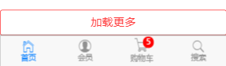

# 项目相关链接

## [vuex](https://github.com/ForeManWang/vuex-study)

## [项目文档](https://github.com/ForeManWang/vue-shopping/tree/master/docs)

## [项目接口说明](https://github.com/ForeManWang/vue-shopping/blob/master/项目和api接口说明文档.docx)

## 技术

框架：vue、webpack

插件：vuex、babel、sass、bootstrap、mint-ui、mui等

## 运行项目

```shell
git clone git@github.com:ForeManWang/vue-shopping.git --depth 1

yarn install
```

在`npm run dev`之前先修改你自己需要运行在的端口号，在**package.json**中修改**dev**中的配置就行

```shell
npm run dev
```

## 项目部分功能和相关截图

> 我这里用的 iphone5 模拟，移动端布局，每个手机都有其对应的，亲测正常

### 公共部分

**评论部分作为公共组件以及加载更多评论**




### 首页

**轮播图 + 六宫格布局 + 路由跳转**

### 新闻资讯

**新闻列表 + 新闻详情 + 新闻详情页发表评论**


### 图片分享

**图片列表 + 图片详情 + 图片评论 + 加载更多**


滑动上方导航条


### 商品购买

**商品列表 + 商品详情 + 商品详情页轮播图 、加入购物车、图文介绍、商品评论、商品结算等**


**图文介绍**：


**商品评论用的公共组件**

**商品结算**：


